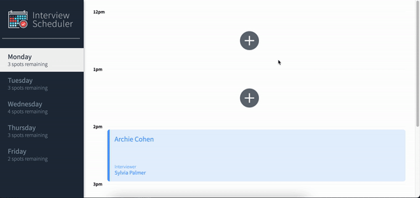

# Interview Scheduler

Interview Scheduler is a simple, SPA that allows users to book an interview with LHL mentors that are available for the day.

## Final Product



## Setup

Install dependencies with `npm install`.

## Running Webpack Development Server

```sh
npm start
```

## Running Jest Test Framework

```sh
npm test
```

## Running Storybook Visual Testbed

```sh
npm run storybook
```

## Running Cypress Test Framework

```sh
npm run cypress
```

## Project Stack

- Front-End: React, Axios, JSX, HTML, SASS, JavaScript

- Back-End: Express, Node.js, PostgreSQL

- Testing: Storybook, Webpack Dev Server, Jest, Testing Library and Cypress

## Dependencies

- Axios
- Classnames
- Normalize.css
- React
- React-dom
- React-scripts
